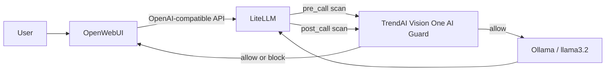

# Secure OpenWebUI with TrendAI Guard and LiteLLM

Run OpenWebUI behind a LiteLLM proxy protected by the TrendAI Vision One AI Guard. The stack scans prompts before model inference and scans model responses before they return to the user.

This repository packages the integration glue. It uses the official OpenWebUI, LiteLLM, Ollama, and [TrendAI LiteLLM Guardrail](https://github.com/trendmicro/tm-v1-ai-guard-litellm-plugin) projects; it is not an official release of those projects.


## How it works



1. OpenWebUI sends chat requests only to LiteLLM's OpenAI-compatible `/v1` API.
2. The TrendAI guardrail runs in `pre_call` mode before LiteLLM invokes Ollama.
3. Allowed prompts reach `llama3.2`; blocked prompts never reach the model.
4. The guardrail runs again in `post_call` mode before the response returns to OpenWebUI.
5. `default_on: true` makes the guardrail apply even when the client does not request it explicitly.
6. `fallback_on_error: block` fails closed if the guard service cannot be reached.

Direct Ollama access is disabled in OpenWebUI so users cannot select an unguarded route.

## Prerequisites

- Docker Desktop or Docker Engine with Compose v2
- A TrendAI Vision One account with AI Guard enabled
- A LiteLLM integration token generated in **Vision One → Workflow and Automation → Third-Party Integrations → LiteLLM**
- At least 12 GB of free Docker storage for the first pull

The Vision One token and endpoint must belong to the same Vision One region.

## Quick start

Clone with the pinned TrendAI plugin submodule:

```bash
git clone --recurse-submodules \
  https://github.com/trend-stefano-olivieri/open-webui-tm-v1-ai-guard-litellm-plugin.git
cd open-webui-tm-v1-ai-guard-litellm-plugin
```

Create the local environment file:

```bash
cp .env.example .env
```

Edit `.env` and replace every placeholder. Generate the two local secrets with a password manager or `openssl rand -hex 32`. Never commit `.env`.

Start the stack:

```bash
docker compose up -d --build
```

The one-shot `ollama-model-loader` service downloads `llama3.2` on first startup. Track progress with:

```bash
docker compose logs -f ollama-model-loader litellm open-webui
```

Open http://localhost:3000 and create the first administrator account. `llama3.2` should appear in the model selector.

## Verify the integration

Confirm that all long-running services are healthy:

```bash
docker compose ps
```

Confirm that LiteLLM registered the guardrail:

```bash
docker compose logs litellm | grep -E 'Initialized TrendAI Guard|trendai-guard'
```

In OpenWebUI, first send a harmless prompt. Then send a prompt that violates a scanner enabled in your Vision One AI Guard policy. A blocked prompt should produce a message similar to:

```text
Blocked by TrendAI Guard. Security violation: Prompt attack detected
```

The screenshot above demonstrates that behavior. Do not use sensitive production data for validation.

## Configuration

### LiteLLM and TrendAI

[`litellm/config.yaml`](litellm/config.yaml) registers the pinned TrendAI plugin in both `pre_call` and `post_call` modes. The plugin reads its API key and endpoint from environment variables.

For hosted Vision One, use the exact endpoint displayed in the LiteLLM integration page. Typical regional endpoints include:

```text
https://api.xdr.trendmicro.com/v3.0/aiSecurity
https://api.eu.xdr.trendmicro.com/v3.0/aiSecurity
```

Self-hosted AWS or Kubernetes deployments should use the Guard API endpoint supplied by that deployment.

### OpenWebUI tool-schema compatibility patch

Small local models can echo OpenWebUI built-in function schemas as ordinary text. The derived OpenWebUI image applies a narrow compatibility patch: when `ENABLE_PLUGINS=false`, built-in tools are not injected into plain chats.

The patch is intentionally fail-fast. If the targeted OpenWebUI source changes, the image build stops instead of silently producing a broken configuration. Review and update [`patches/apply_openwebui_builtin_tools_gate.py`](patches/apply_openwebui_builtin_tools_gate.py) before changing `OPEN_WEBUI_IMAGE`.

### Key rotation

OpenWebUI persists connection settings in its data volume. After rotating `LITELLM_MASTER_KEY`, update the LiteLLM connection key under **Admin Settings → Connections**, or start with a fresh `open-webui-data` volume. A stale persisted key can cause LiteLLM to return `No connected db` and hide the model list.

## Operations

```bash
# Stop services while preserving model and OpenWebUI data
docker compose down

# Restart after configuration changes
docker compose up -d --build

# Follow runtime logs
docker compose logs -f litellm open-webui
```

Do not use `docker compose down -v` unless you intend to delete downloaded Ollama models and OpenWebUI application data.

## Production guidance

- Pin container images by immutable digest after validation.
- Remove `--detailed_debug` from the LiteLLM command after initial troubleshooting; debug logs can contain prompts and responses.
- Keep `fallback_on_error: block` for fail-closed enforcement.
- Do not expose port `4000` publicly. It is published here for local testing and should be restricted or removed in production.
- Terminate TLS at a trusted reverse proxy and configure explicit CORS origins.
- Back up the OpenWebUI and Ollama volumes before upgrades.
- Review upstream release notes before updating OpenWebUI, LiteLLM, or the TrendAI submodule.

## Troubleshooting

### `llama3.2` is missing

Verify LiteLLM can see it:

```bash
docker compose exec -T open-webui sh -lc \
  'curl -fsS -H "Authorization: Bearer $OPENAI_API_KEY" http://litellm:4000/v1/models'
```

If LiteLLM returns the model but OpenWebUI does not, check for a stale persisted LiteLLM key as described under **Key rotation**.

### Function JSON appears as the assistant response

Confirm the patched image was built and `ENABLE_PLUGINS=false` is present:

```bash
docker compose exec -T open-webui sh -lc \
  "grep -A6 'use_builtin_tools =' /app/backend/open_webui/utils/middleware.py"
```

Start a new chat after rebuilding; old malformed messages remain in conversation history.

### Build fails with `No space left on device`

Inspect reclaimable Docker storage:

```bash
docker system df
```

Review the output before pruning. Image and cache cleanup can remove layers needed by other local projects.

## Security and privacy

See [SECURITY.md](SECURITY.md). Prompt and response content is sent to the configured TrendAI Guard API for inspection. Confirm data handling, residency, and retention requirements for your environment before production use.

## Licensing

The integration files in this repository are licensed under Apache License 2.0; see [LICENSE](LICENSE).

Third-party components keep their own licenses. See [THIRD_PARTY_NOTICES.md](THIRD_PARTY_NOTICES.md), the pinned plugin's [Apache 2.0 license](vendor/tm-v1-ai-guard-litellm-plugin/LICENSE), and the included [OpenWebUI license copy](LICENSES/Open-WebUI-License.txt).
